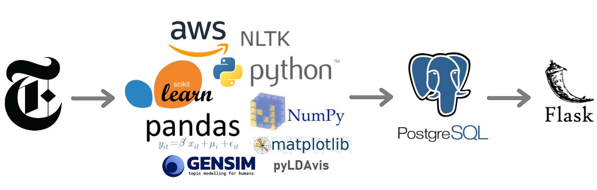
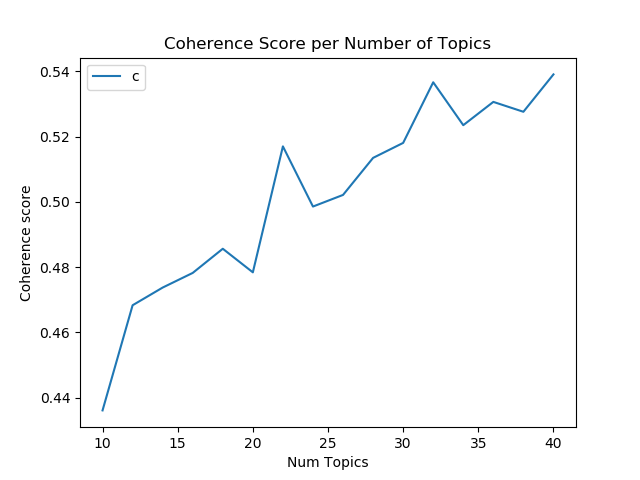
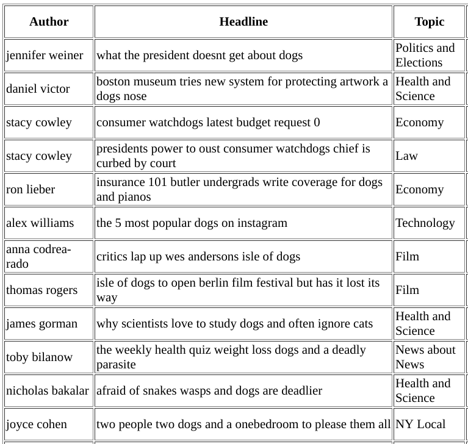
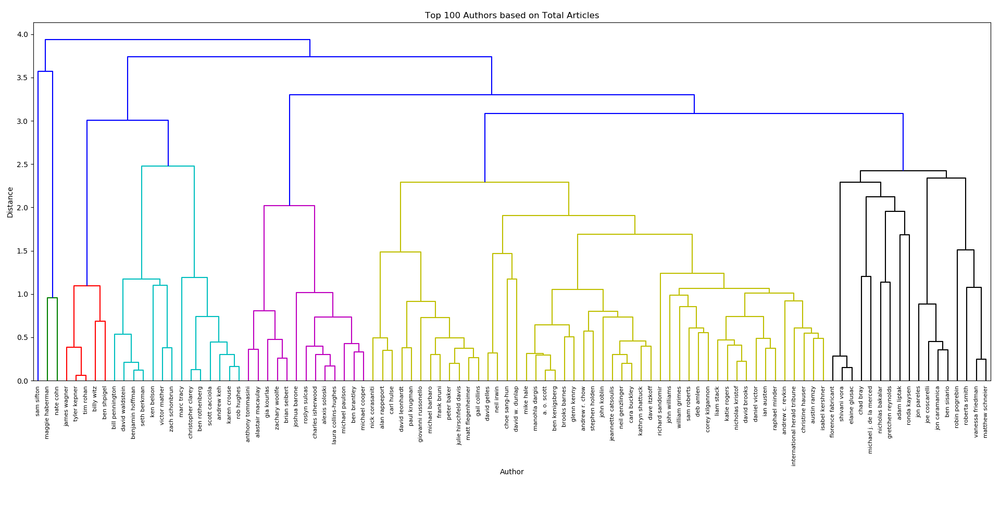
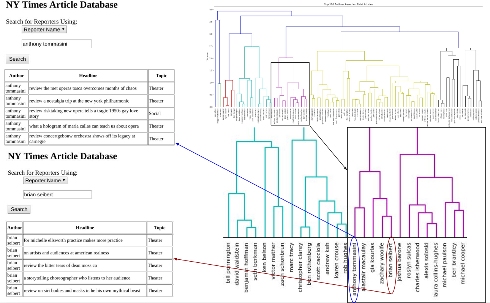

# NewsClusters

## Background
Recently, my girlfriend got a new job as a media strategist for an environmental organization. She'd never worked in the NY area before, so she faced the tough task of learning about the different reporters specific to the northeast region. Individuals who work in communications and public relations, often need to find reporters to write about issues that are important to their organization. But how could they find these new authors without actually reading their stories? I  had an idea - what about a machine learning application that would intake text, assign topics based on content, and allow her to search for unknown reporters based on topics they write about. She could then also see which other reporters write about similar topics, allowing her to find out about new reporters without actually searching through the news and reading all of their stories.

## Approach
* Data Collection
* Data Cleaning
* Topic Modeling
* Clustering
* Web Interface

## Data Collection
I decided to use the last five years of New York Times articles, but only the headline and lead of each article.  The data is offered for free by the NYTimes in json format using their Archive API.  I set up an EC2 instance using AWS, and created a python script that connected to the API, downloaded the archives one month at a time, and then pre-cleaned and combined the months into year-long dataframes.

In all, I collected more than 230,000 articles written by over 13k different authors going back through 2014.

## Data Cleaning
After gathering the data, several steps were taken to clean the data for topic analysis.
* Unneeded columns were removed.
* Articles with more than one author were removed.
* Author IDs were created using first, middle, and last name.
* Article IDs were created using the tail of the URL.
* Text was cleaned for punctuation and case.
* Headline and lead were combined into one column for NLP.
* Duplicate articles were removed.

After cleaning, I ended up with 197,603 articles written by 12,703 different authors.

I then created a PostgreSQL database with author, article, and topic tables and imported all of the data from each article to the articles table.

## Topic Modeling
I decided to use LDA to perform topic modeling. I started by using Gensim's LDA package, and I performed the following preprocessing tasks:
* Stopwords were removed.
* Text was stemmed and lemmatized using gensim's default settings.
* Bigrams and trigrams were created.
* Created word corpus.

I randomly chose 8, 10, 16, and 20 topics, and I didn't get very good results. My best result was a coherence score of .26 using 10 topics.  You can see from the plot below (created using pyLDAvis) that the topics are overlapping one another, and there is very little clarity in the topics - the words don't allow for any kind of logical inference.

<iframe src = "plots/lda_gensim.html" width = "1250" height = "875">
    Sorry your browser does not support inline frames.
    <a href="plots/lda_gensim.html">Try this link.</a>   
</iframe>

I then created a for loop to try different numbers of topics, and recorded the coherence score for each number of topics, and I discovered that there was a significant increase in coherence score until about 22 topics, at which point the score leveled off.
 

I then decided to try using the Mallet LDA package, created by UMASS and Gensim has a wrapper for it so that you can easily apply it on top of the Gensim pipeline.   I also made the following tweaks to preprocesing and recreated the corpus.
* Text was stemmed and lemmatized, but only nouns and verbs were included.  Adjectives and adverbs were ignored.
* Extreme words were removed.  Words that occurred in more than 50% of documents were ignored, and words that were in less than 15 documents total were ignored.

I then ran the model using the preprocessing settings, Mallet LDA, and 22 topics, and this produced extremely clear results.  The coherence score more than doubled to .57, and you can see the clarity in the topics below.

<iframe src = "plots/lda_mallet.html" width = "1250" height = "875">
    Sorry your browser does not support inline frames.
    <a href="plots/lda_mallet.html">Try this link.</a>   
</iframe>

It was extremely easy to infer human-useable terms to represent each topic.  Below are the terms I used to describe each of the 22 topics, and a sample of the words that were represented the most in that topic:

* **NY Local** - york, city, brooklyn, manhattan, water, home, park, resident... 
* **Crime** - man, kill, police, attack, charge, death, fire, accuse, shoot... 
* **Politics & Elections** - house, campaign, election, vote, donald_trump... 
* **Foreign Affairs** - china, power, move, face, trade, russia, france... 
* **War and Conflict** - country, fight, war, force, europe, fear, battle, syria... 
* **Health & Science** - find, study, health, test, risk, drug... 
* **News About News** - time, talk, news, week, report, discuss... 
* **Tech & Business** - company, apple, amazon, facebook, investor... 
* **Economy** - pay, raise, market, bank, deal, sale, money... 
* **Labor** - make, open, job, line, spend, worker, growth, increase... 
* **Travel** - home, food, offer, summer, hotel, tour, travel, island, holiday... 
* **Fashion & Art** - show, art, museum, paris, designer, wear, collection... 
* **Local Sports** - run, win, yankees, ranger, giant, series, loss, strike, series... 
* **National Sports** - game, team, win, player, coach, world_cup, soccer... 
* **World News** - world, year, britain, leave, office, begin, scandal... 
* **Education** - school, program, student, question, college, university, child... 
* **Music** - music, year, career, record, album, jazz, singer, band, pop... 
* **Government** - call, leader, state, plan, senate, group, government... 
* **Law & Judicial** - case, rule, court, law, charge, judge, accuse... 
* **Film & TV** - film, review, series, movie, star, tv, show, night, host... 
* **Theater** - theater, broadway, role, festival, review, dance, stage... 
* **Family & Social** - woman, book, family, child, love, story, mother, son...

## Web Interface
In order to search the database and see which topics are being assigned to each article and author, I created a flask application that integrates with the PostgreSQL database.  
I created a search function that allows you to search by keywords in the headline, or the name of the author, or by topic.

Here are some of the results when I searched for "dogs" in the headline.  If you read the headline, you can see that the topics are accurately describing the content of each article.

## Clustering
I then created an authors table in the PostgreSQL database, and added a column for each topic, and  entered the percentage of each author's articles for the column in which that topic was the dominant topic.  I was able to then use hierarchical LDA clustering to group authors based on their distribution of topics.

To more easily visualize this, I clustered the 100 authors with the most articles.  You can see that it is correctly grouping together authors that write about similar topics.

## Next Steps
I'd like to make this much more user-friendly, and in order to do that I need to make the flask search much smoother and more useful by including more information about each author, and by showing author-to-author search results to find authors that write about topics similar to one another.

Additionally, I'd like to include news from many more major news outlets in order to make this more worthwhile.