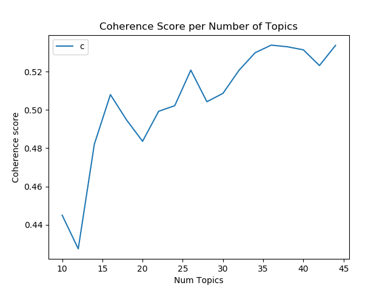
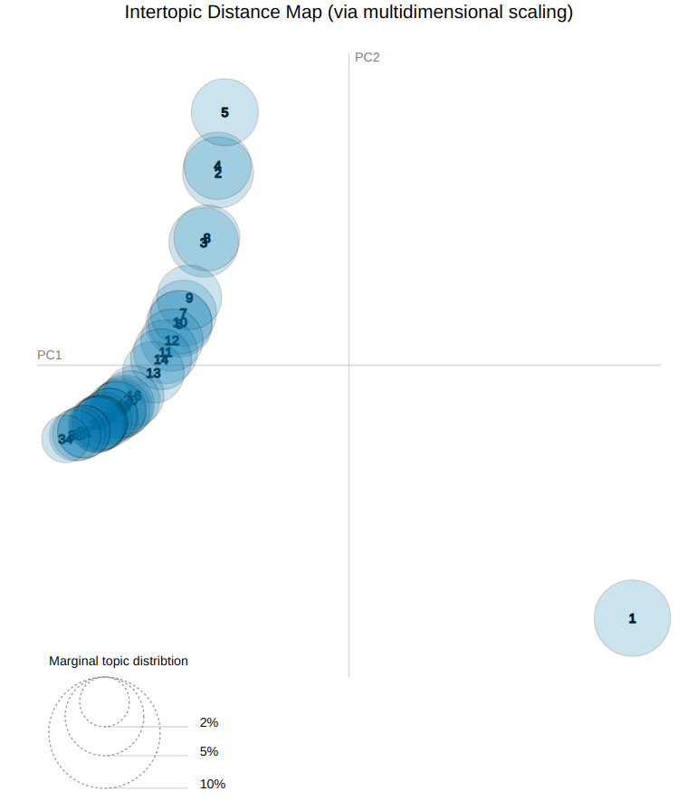
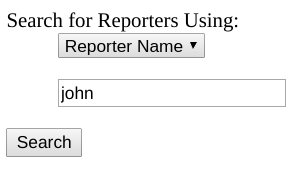
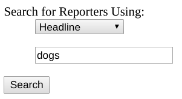
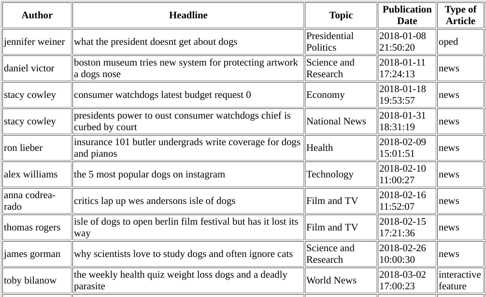

# NewsClusters

## Background
Recently a friend of mine was hired as a media strategist in the northeast region for an environmental organization. She'd never worked in the NY area before, so she faced the tough task of learning about the different reporters specific to the area. Individuals who work in communications and public relations, often need to find reporters to write about issues that are important to their organization. But how could they find these new authors without actually reading their stories? I had an idea - what about a machine learning application that would intake text, assign topics based on content, and allow her to search for unknown reporters based on topics they write about. She could then also see which other reporters write about similar topics, allowing her to find out about new reporters without actually searching through the news and reading all of their stories.

## Approach
* Data Collection
* Data Cleaning
* Topic Modeling
* Clustering
* Web Interface

## Data Collection
I decided to use the last five years of New York Times articles, but only the headline and lead of each article.  The data is offered for free by the NYTimes in json format using their Archive API.  I set up an EC2 instance using AWS, and created a python script that connected to the API, downloaded the archives one month at a time, and then pre-cleaned and combined the months into year-long dataframes.

In all, I collected more than 230,000 articles written by over 13k different authors going back through 2014.

## Data Cleaning
After gathering the data, several steps were taken to clean the data for topic analysis.
* Unneeded columns were removed.
* Articles with more than one author were removed.
* Author IDs were created using first, middle, and last name.
* Article IDs were created using the tail of the URL.
* Text was cleaned for punctuation and case.
* Headline and lead were combined into one column for NLP.
* Duplicate articles were removed.

After cleaning, I ended up with 197,603 articles written by 12,701 different authors.

I then created a PostgreSQL database with author and article tables and imported all of the data from each article to the articles table.

## Topic Modeling
I decided to use LDA to perform topic modeling. I started by using Gensim's LDA package, and I performed the following preprocessing tasks:
* Stopwords were removed.
* Text was stemmed and lemmatized using gensim's default settings.
* Bigrams and trigrams were created.
* Created word corpus.

I randomly chose 8, 10, 16, and 20 topics, and I didn't get very good results. My best result was a coherence score of .23 using 10 topics.  You can see from the plot below (created using pyLDAvis) that the topics are overlapping one another, and there is very little clarity in the topics - the words don't allow for any kind of logical inference.

I then created a for loop to try different numbers of topics, and recorded the coherence score for each number of topics, and I discovered that there was a significant increase in coherence score until about 34 topics, at which point the score leveled off.

So I then again tried the Gensim LDA package, this time with 34 topics, but I still had poor results.

So I decided to try using the Mallet LDA package, which is created by UMASS and Gensim has a wrapper for it so that you can easily apply it on top of the Gensim pipeline.   I also made the following tweaks to preprocesing and recreated the corpus.
* Text was stemmed and lemmatized, but only nouns and verbs were included.  Adjectives and adverbs were ignored.
* Extreme words were removed.  Words that occurred in more than 50% of documents were ignored, and words that were in less than 15 documents total were ignored.

I then ran the model using the preprocessing settings, Mallet LDA, and 34 topics, and this produced extremely clear results.  The coherence score more than doubled to .54, and you can see the clarity in the topics below.

It was extremely easy to infer human-useable terms to represent each topic.  Below are the terms I used to describe each of the 34 topics, and a sample of the words that had the most relevance to that topic:

* **Presidential Politics** - trump, president, policy, obama, donald_trump, administration... 
* **Society** - women, change, america, man, power, focus, girl, society, history, nation... 
* **Hope and Resilience** - give, lead, hope, lose, remain, end, start, struggle... 
* **Performing Arts** - review, play, theater, festival, dance, work, stage, broadway... 
* **Economy** - pay, bank, money, market, price, percent, cut, raise, cost, tax... 
* **Technology** - service, company, video, technology, datum, facebook, apple, internet... 
* **World News** - report, news, week, test, american, accord, happen, talk... 
* **National News** - rule, plan, bill, car, law, power, limit, ban, effort, measure... 
* **Court and Law** - case, court, judge, charge, accuse, lawyer, claim, trial... 
* **Disaster** - home, people, move, fire, town, community, california, area, build... 
* **Elections** - state, party, election, vote, republican, debate, campaign, race... 
* **Conflict** - fight, war, group, force, country, battle, europe, fear, aid... 
* **Business** - company, deal, business, sell, buy, offer, investment, firm... 
* **Education** - school, student, program, college, learn, university, give... 
* **Fashion** - show, fashion, designer, line, style, brand, collection... 
* **Food** - food, restaurant, open, serve, bar, chef, cook, eat, drink, recipe... 
* **Family** - life, family, love, friend, mother, live, story, son, father, boy... 
* **Art** - work, art, artist, museum, history, exhibition, culture, master, gallery... 
* **Transportation** - day, land, air, train, minute, flight, strike, storm, crash... 
* **Announcements** - year, return, leave, end, meet, join, club, announce, replace... 
* **Housing** - york, city, brooklyn, street, manhattan, park, building, project, queens... 
* **Crime** - man, kill, police, death, attack, people, protest, shoot, arrest, officer... 
* **Movements** - day, event, draw, celebrate, year, moment, summer, washington, king, march... 
* **Government and Regulation** - face, challenge, call, issue, security, official, agency... 
* **Music** - music, album, award, song, record, voice, singer, band, rock, concert... 
* **Innovation** - world, make, thing, watch, idea, rise, surprise, mystery, decade... 
* **Film and TV** - show, film, star, series, review, tv, role, actor, character, director... 
* **Science and Research** - find, child, study, age, scientist, researcher, animal, scince... 
* **Foreign Affairs** - china, leader, country, trade, government, russia, britain, israel... 
* **Local Sports** - run, season, yankee, met, start, game, win, series, giant, baseball... 
* **Travel** - plan, hotel, offer, travel, tour, trip, water, island, road, visit, mexico... 
* **Football (and Futbol)** - team, game, player, win, coach, soccer, match, nfl, world_cup... 
* **Health** - health, people, risk, drug, doctor, heart, care, expert, union, hospital... 
* **Books and Writing** - book, write, story, writer, talk, life, author, discuss, cover... 

## Web Interface
In order to search the database and see which topics are being assigned to each article and author, I created a flask application that integrates with the PostgreSQL database.  
I created a search function that allows you to search by keywords in the headline, or the name of the author, or by topic. 
  ...  

## Results
You can see how accurate the topic modeling is.  This results page shows the dominant topic for srticles written by someone with "john" in their name.  If you read through the headlines of each article, you can see that the assigned topic is extremely accurate.

Here are some of the results when I searched for "dogs" in the headline.  If you read the headline, you can see that the topics are accurately describing the content of each article.

## Clustering
I then created an authors table in the PostgreSQL database, and added a column for each topic, and  entered the percentage of each author's articles for the column in which that topic was the dominant topic.  I was able to then use hierarchical LDA clustering to group authors based on their distribution of topics.

To more easily visualize this, I clustered the 100 authors with the most articles.  You can see that it is correctly grouping together authors that write about similar topics.

## Next Steps

* Improve appearance and user-friendliness of flask app
* Add more search options to flask app, such as author to author searches and results, and search by topic. 
* Improve code - make the code more modular with parameters to specify which model to use, how may topics, how to clean the data, etc.
* Include much larger number of news sources.
